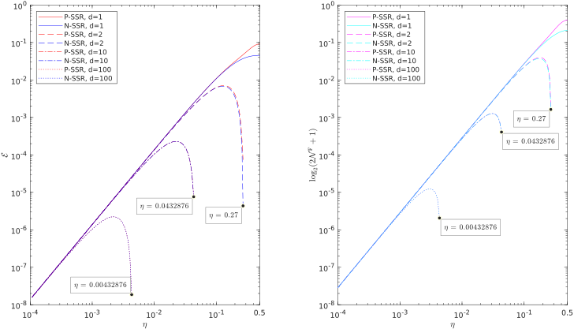
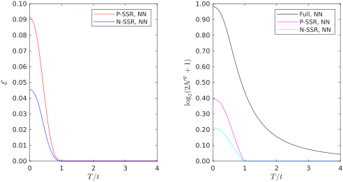
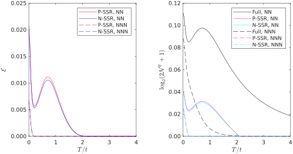

## Two-site entanglement in noninteracting lattice systems

#### Gaussian density matrices (for two-site subsystems)

`RDM0` implements the Peschel-Chung-Eisler theorem [1,2,3] for evaluating
the reduced density matrix of a free fermion system. It encapsulates the
Wick contractions in a simple, closed one-to-one expression, relating the
Entanglement Hamiltonian $H_\mathrm{E}$ to the one-body correlation matrix $G$: 

$$
H_\mathrm{E}^\intercal = \log((1-G)*G^{-1})
$$

Then the reducend density matrix $\rho$ is just given as 

$$
\rho = \mathrm{e}^{-\tilde{H}_\mathrm{E}}
$$

where $\tilde{H}_\mathrm{E}$ is the many-body representation of the single
body operator $H_\mathrm{E}$. To evaluate in an efficient way this, we precompute the Slater-Condon overlaps (single-body excitations between all
the given Fock states) with the included `SlaterCondon` function.

Overall, the Peschel-Chung-Eisler formulation is known to be very efficient
for computing reduced density matrices for small-enough subsystems, whereas it introduced nontrivial numerical issues for large ones (the $G$ matrix becomes singular, as all eigenvalues become very close to either $1$ or $0$) [3]. As we are interested in two-site RDMs, the issue does not touch us at all, leading to a reliable, semi-analytical treatment of the noninteracting models.

#### Superselected negativities

We implement the superselection of the two-site negativity in `ssr_negativity`, which depends on `partial_transpose`. The full fermionic negativity is computed by `negativity`. 

#### Superselected relative entropies

We provide, for benchmark, implementations of the superselected relative entropy of entanglement, as introduced in [4]

#### Replication of known results for a 1D chain

`Test1D` provides a replication of the results published in [5] for the superselected entanglement of a noninteracting tight-binding chain. Not only we reproduce exactly the analytical results for the superselected relative entropy (left panel), but we also retrieve the same main message with the newly proposed superselected negativity (right panel).

Albeit not identical in quantitative details ---as, for instance, the position of the local maximum for the next-nearest-neighbor (NNN) entanglement--- the superselected negativities match exactly the critical doping for the sudden death of entanglement.

#### Thermal death of entanglement in the noninteracting chain

On the same model, we explore the evolution of superselected negativities and relative entropies, to find a thermal death of entanglement, at different fillings. For the negativity only, we are able to evaluate also the full ("non-superselected") entanglement (calling the provided `negativity` function), to confirm that the thermal death can only be witnessed under parity or charge superselection rules. See the associated paper for further details.

#### References

[1] Ming-Chiang Chung and Ingo Peschel, [Phys. Rev. B 64, 064412 (2001)](https://doi.org/10.1103/PhysRevB.64.064412)    
[2] Ingo Peschel, [J. Phys. A: Math. Gen. 36 L205 (2003)](https://doi.org/10.1088/0305-4470/36/14/101)    
[3] Ingo Peschel and Viktor Eisler, [J. Phys. A: Math. Theor. 42 504003 (2009)](https://doi.org/10.1088/1751-8113/42/50/504003)    
[4] Lexin Ding, Zoltan Zimboras and Christian Schilling, [arXiv:2207.03377 (2022)](https://arxiv.org/abs/2207.03377)   
[5] Lexin Ding, Gesa Dünnweber and Christian Schilling, [Quantum Sci. Tech. 9, 015005 (2023)](https://iopscience.iop.org/article/10.1088/2058-9565/ad00d9)